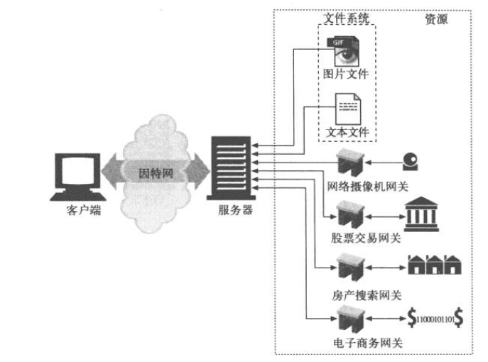
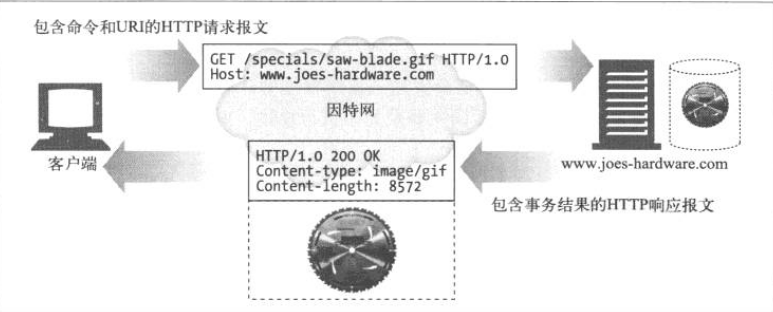

====================
HTTP概述
====================
这一章主要介绍了HTTP协议的一些基本概念，
这样大家会对HTTP有一个基本的了解。

Web客户端和服务器
====================
.. image:: _static/web_clients_and_servers.png

Web资源
====================
资源既可以是静态文件，也可以是根据需求动态生成的。

媒体类型
====================
资源多了，就要分类。HTTP采用了MIME类型。
MIME类型原来是在邮件里面使用的，由于它很成熟也很好用，
所以HTTP也采用了。

Web服务器会为所有的HTTP对象数据附加一个MIME类型。

当浏览器从服务器中取回一个对象时，会去查看相关的MIME类型，
这样它就知道如何处理这个对象了。

常用MIME类型举例：

+ HTML格式的文本文档：text/tml
+ 普通的ASCII文本文档：text/plain
+ JPEG格式的图片：image/jpeg

URI
====================
Uniform Resource Idenifier: 统一资源标识符

URI有两种形式：URL和URN。

URL
--------------------
统一资源定位符，它描述了一台特定服务器上某资源的特定位置。

大部分URL都遵循一种标准格式：

+ 第一部分：方案(scheme)，说明了使用的协议类型。
+ 第二部分：服务器地址。
+ 其余部分：服务器上的某个资源。

URN
--------------------
统一资源名，作为特定内容的唯一名称使用，与资源的所在地无关。
现实中用的很少，还处于试验阶段。

事务
====================
一个HTTP事务由一条（客户端发给服务器）的请求消息和
一个（从服务器发回客户端）的响应消息组成。

这种通信是通过名为HTTP报文（HTTP message）的格式化数据块进行的。

方法
====================
每条HTTP请求报文都包含一个方法，这些叫做HTTP方法（HTTP method）。

这些方法会告诉服务器要执行什么动作。

.. list-table:: 常见的HTTP方法
   :widths: 10 20
   :header-rows: 1

   * - 方法名
     - 说明
   * - GET
     - 获取资源
   * - PUT
     - 更新资源
   * - DELETE
     - 删除资源
   * - POST
     - 添加资源
   * - HEAD
     - 获取HTTP响应首部

状态码
====================
每条HTTP响应报文返回时都会携带一个状态码。

状态码是一个三位数字，用来告知客户端请求是否成功，
或者是否需要采取其它动作。

HTTP的响应报文中除了会返回状态码之外，还会同时返回对应的原因短语。

常见HTTP状态码：

+ 200 OK：文档正常返回
+ 302 Redirect：重定向，到其它地方获取资源
+ 404 Not Found：没找到，无法找到该资源

报文
====================
HTTP报文是由一行行的简单字符串组成的。HTTP报文都是纯文本，非二进制代码。

.. image:: _static/http_messages.png

HTTP报文分为：

+ 请求报文（request message）
+ 响应报文（response message）

HTTP报文包括以下三个部分：

+ 起始行

  报文的第一行就是起始行，
  在请求报文里说明要做些什么，
  在响应报文中说明出现了什么情况。
+ 首部字段

  起始行后面有零个或多个首部字段。
  每个字段都包含一个名字和一个值。两者用：号分割。
  首部以一个空行结束。
+ 主体

  空行之后就是可选的报文主体了。其中包含了所有类型的数据。
  请求报文主体中包含了要发给服务器的数据；响应报文主体中包含了
  要返回客户端的数据。主体中可以包含任意的二进制数据。

.. image:: _static/http_get_transaction.png

连接
====================
HTTP是个应用层协议，它将联网的具体细节交给了TCP/IP协议。
所以在HTTP客户端向服务器发送报文之前，需要用IP地址及端口号在
客户端与服务器之间建立一条TCP/IP连接。

之前有讲过，客户端是通过URL来请求资源的。
所以IP地址及端口也是从URL中获取到的。

下面简单介绍一下浏览器的连接步骤：

+ 浏览器从URL中解析出服务器的主机名/域名
+ 浏览器将主机名/域名通过DNS服务转换成服务器的IP地址
+ 浏览器将端口号从URL中解析出来（没有则用默认的端口号）
+ 浏览器建立一条与服务器的TCP连接
+ 浏览器向服务器发送一条HTTP请求报文
+ 服务器向浏览器回送一条HTTP响应报文
+ 浏览器关闭连接，渲染并显示文档

Web的结构组件
====================
代理
--------------------
位于客户端和服务器之间。

一般的应用场景是，客户端无法访问某些服务器，但是可以连接到某台设备，
而这台设备可以访问这些服务器，那么就可以在这个设备上开启一个代理服务器，
客户端通过走这台设备的代理就可以访问那些它之前无法访问的服务器了。

.. image:: _static/http_proxy.png

缓存
--------------------
它是一种特殊的代理服务器，可以将经过代理传送的常用文档保存下来，
当有其它客户端或者该客户端再次请求相同文档时，
就可以直接将缓存的文档返回了。

.. image:: _static/http_proxy_cache.png

网关
--------------------
也是一种特殊的代理服务器中，通常是将HTTP请求转换成其它协议的请求。

隧道
--------------------
对HTTP通信报文进行盲转发的特殊代理。
在一条或者多条HTTP连接上转发非HTTP数据，转发时不会窥探数据。

常用的就是HTTPS，通过HTTP连接承载加密安全套接字层（SSL）。

Agent代理
--------------------
是指代表客户发起HTTP请求的客户端程序。

最有代表性的就是：浏览器。
