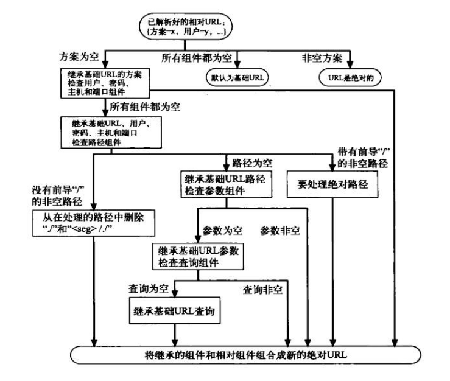
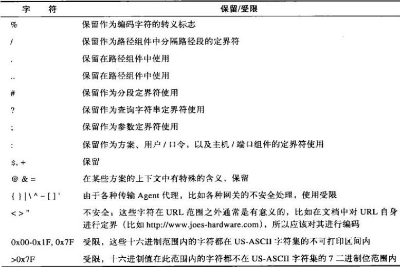

====================
URL与资源
====================
.. image:: _static/url.png

URL语法
====================
大多数URL的格式：

    <scheme>://<user>:<password>@<host>:<port>/<path>;<params>?<query>#<frag>

其中最重要的是scheme, host, path。

.. image:: _static/url_format.png

相对URL
====================
有时候网页里面的URL不是绝对路径的，
那么就会有相应的算法将之转换成绝对URL。

转义字符
====================
为了在URL中表示各种不安全的字符，
需要在URL用转义字符来表示这些不安全的字符。

这种转义表示法包含一个百分号，后面跟着两个表示字符ASCII码的16进制数。

.. list-table:: 一些编码字符举例
   :widths: 10 10 40
   :header-rows: 1

   * - 字符
     - ASCII码
     - 示例URL
   * - ~
     - 126(0x7E)
     - http://www.joes-hardware.com/%7Ejoe
   * - 空格
     - 32(0x20)
     - http://www.joes-hardware.com/more%20tools.html

保留字符
====================
在URL中，有几个字符被保留起来，有特殊的用途。

